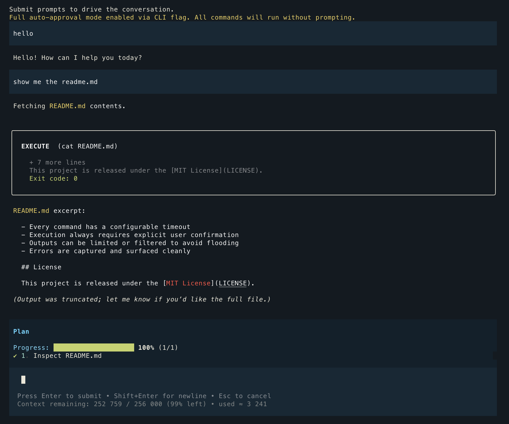

# OpenAgent

OpenAgent is a Node.js-based CLI agent that communicates with an LLM using a structured JSON protocol. It safely executes shell commands with human-in-the-loop approval, live progress tracking, and output controls.

> _Demonstration note: this line was added using the `TODO: update docs` command._

If you want the very slim, no extra fluff version, check this early commit:
https://github.com/asynkron/OpenAgent/tree/9073a48225ddc2c2afc6f701af48d6ec4c04e477 - 400 LoC

## Example chat

```
Plan ______________
✔ Step 1 - Review brain directory guidance
✔ Step 2 - Inspect relevant CLI modules for human-interaction flow
✔ Step 3 - Draft TODO plan for implementing --nohuman flag
▶ Step 4 - Implement --nohuman flag behavior in CLI
• Step 5 - Run syntax/tests and verify behavior
• Step 6 - Summarize changes and next steps

Command ______________
Shell: bash
Directory: /Users/rogerjohansson/git/asynkron/OpenAgent
Timeout: 60s
Auto-approved by CLI flag (--auto-approve)

Command Result ______________
Exit Code: 0
Runtime: 3ms
Status: COMPLETED

STDOUT ______________
  Edited src/agent/loop.js
  "use strict";

  /**
   * Implements the interactive agent loop that powers the CLI experience.
   *
   * Responsibilities:
   * - Maintain the conversation history with OpenAI responses.
   * - Render assistant output, prompt the human for approvals, and execute commands.
   * - Feed execution results back to the model to continue the workflow.
   *
   * Consumers:
   * - Library entry `src/lib/index.js` creates a configured loop via `createAgentLoop()` and exposes it as `agentLoop`.
   * - Integration tests re-export the same function to run mocked scenarios.
   */

  import chalk from 'chalk';

  import { SYSTEM_PROMPT } from '../config/systemPrompt.js';
  import { getOpenAIClient, MODEL } from '../openai/client.js';
  …


Sending request to AI
Received response from AI

Command ______________
Shell: bash
Directory: /Users/rogerjohansson/git/asynkron/OpenAgent
Timeout: 60s

  sed -n '200,300p' src/agent/loop.js


Auto-approved by allowlist (approved_commands.json)
```

## Table of Contents

- [Features](#features)
- [Getting Started](#getting-started)
- [Configuration](#configuration)
- [Usage](#usage)
- [JSON Protocol](#json-protocol)
- [Templates & Shortcuts](#templates--shortcuts)
- [Safety](#safety)
- [License](#license)

## Features

- **Structured JSON Protocol** for deterministic LLM↔agent communication
- **Command Execution with Timeouts** and interactive approval
- **Plan Visualization** showing task progress as a checklist
- **Output Filtering** via regex and tail limits
- **Conversation History** persisted across steps for context retention

## Getting Started

1. Clone the repository:
   ```bash
   git clone <your-fork-url>
   cd openagent
   ```
2. Install dependencies:
   ```bash
   npm install
   ```
3. Copy the environment template into the CLI workspace and add your OpenAI API key:
   ```bash
   cp .env.example packages/cli/.env
   ```

### Quality tooling

- `npm run lint` — runs ESLint with the shared configuration.
- `npm run format` — formats the repository with Prettier.
- `npm run format:check` — verifies committed files already match the Prettier style.

## Configuration

Edit `packages/cli/.env` to include the required secrets (this is where the CLI loads configuration from by default):

```
OPENAI_API_KEY=sk-...
# Optional: override the default model (defaults to gpt-5-codex)
# OPENAI_MODEL=gpt-4.1-mini
# Optional: override the assumed model context window (tokens, defaults to 256000)
# OPENAI_CONTEXT_WINDOW=256000
# Optional: set reasoning effort for reasoning-enabled models (one of low, medium, high)
# OPENAI_REASONING_EFFORT=medium
# Optional: enforce a request timeout (milliseconds)
# OPENAI_TIMEOUT_MS=60000
# Optional: configure automatic retry attempts for transient API errors
# OPENAI_MAX_RETRIES=2
# Optional: point at a custom Responses API endpoint (must be the API root, not a completions URL)
# OPENAI_BASE_URL=https://api.openai.com/v1
```

If this file is missing, the CLI will exit with a reminder to create `packages/cli/.env` (for example by copying `.env.example`) and set `OPENAI_API_KEY` before trying again.

The client validates that the configured model supports the Responses API and that any custom base URL targets the API root, so misconfigurations fail fast.

## Usage

Start the CLI agent:

```bash
npm start
```

Interaction loop:

1. Type a task and press **Enter**
2. Review the agent’s explanation and plan
3. Inspect proposed commands (they won’t run without approval)
4. Press **Enter** to execute, or type `skip`
5. View results; repeat until the task completes

To exit, type `exit` or `quit` at any prompt.

## JSON Protocol

**LLM → Agent** messages look like:

```json
{
  "message": "status update",
  "plan": [{ "step": 1, "title": "Describe goal", "status": "running" }],
  "command": {
    "shell": "bash",
    "run": "ls -a",
    "cwd": ".",
    "timeout_sec": 60,
    "filter_regex": "error|warning",
    "tail_lines": 200
  }
}
```

**Agent → LLM** observations:

```text
{
  "role": "assistant",
  "content": "I ran the command: ls -a. It finished with exit code 0.\n\nStructured payload:\n{\n  \"stdout\": \"output\",\n  \"stderr\": \"\",\n  \"exit_code\": 0,\n  \"truncated\": false\n}\n\nMetadata:\n{\n  \"runtime_ms\": 120,\n  \"killed\": false,\n  \"timestamp\": \"2025-02-01T12:00:00Z\"\n}"
}
```

## Templates & Shortcuts

- **Command templates** in `templates/command-templates.json`:
  - List: `npx openagent templates list` (or `node ./bin/openagent.js templates list`)
  - Show: `npx openagent templates show <id>`
  - Render: `npx openagent templates render <id> '{"var":"value"}'`
- **Shortcuts** in `shortcuts/shortcuts.json`:
  - List: `npx openagent shortcuts list`
  - Show: `npx openagent shortcuts show <id>`
  - Run (prints command): `npx openagent shortcuts run <id>`

## Safety

- Every command has a configurable timeout
- Execution always requires explicit user confirmation
- Outputs can be limited or filtered to avoid flooding
- Errors are captured and surfaced cleanly

## License

This project is released under the [MIT License](LICENSE).
