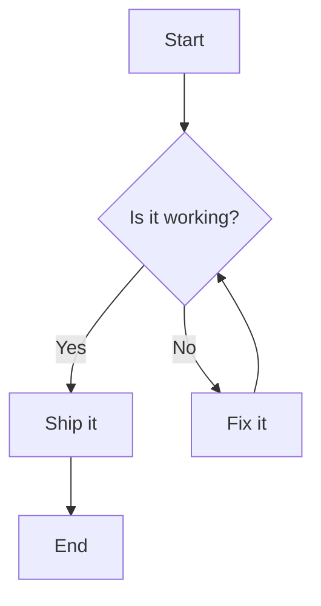

# Mermaid Diagram

This file contains a simple Mermaid flowchart. You can preview it in GitHub, VS Code (with Mermaid preview extensions), or any Markdown viewer that supports Mermaid.

## Notes
- Edit the diagram by modifying the Mermaid code block above.
- Change 'flowchart TD' to 'sequenceDiagram', 'classDiagram', 'stateDiagram', 'erDiagram', 'gantt', or 'pie' for other diagram types.
