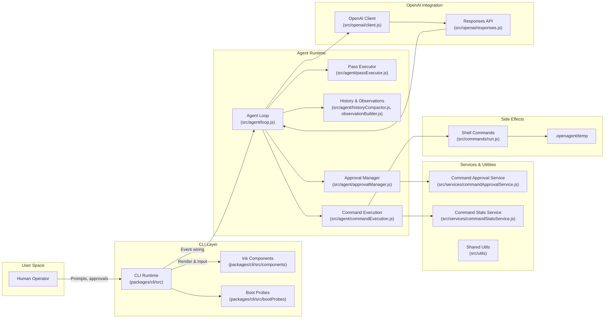
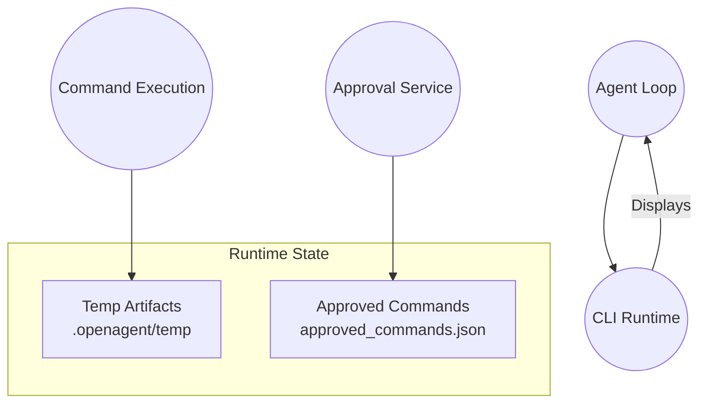

# OpenAgent Architecture Overview

This document provides a high-level map of the major subsystems that make up OpenAgent.
It focuses on the CLI distribution, which wires the agent runtime to terminal-based
interactions while delegating heavy lifting to modular services.

## System Topology



## Runtime Event Flow

The agent loop drives a structured sequence each time the model produces an action.

```mermaid
sequenceDiagram
participant U as User / CLI Input
participant CLI as CLI Runtime
participant Loop as Agent Loop
participant OA as OpenAI Response
participant AP as Approval Manager
participant CE as Command Executor
participant SR as Shell Handler

U->>CLI: Provide command or approval

Loop->>OA: Submit structured request [prompt, history, plan]
OA-->>Loop: Return model response [messages, tool calls]
Loop->>Loop: Parse and validate response

alt Requires command execution
    Loop->>AP: Request approval [auto or manual]
    AP-->>Loop: Approval decision

    alt Approved
        Loop->>CE: Dispatch command request
        CE->>SR: Execute shell command [with limits]
        SR-->>CE: Return stdout/stderr or file contents
        CE-->>Loop: Structured observation
    else Rejected
        Loop-->>CLI: Emit rejection notice
    end

else Model continues reasoning
    Loop->>OA: Submit follow-up request [executor context]
end

Loop-->>CLI: Emit observations, plan updates, status
CLI-->>U: Render output [Ink components]
```

## Key Responsibilities

- **CLI (`packages/cli/src`)**
  - Boot probes confirm toolchain availability before session start.
  - Ink components render model thoughts, plan progress, and command output.
  - Runtime wires keyboard input (ESC, approvals) into the agent loop.

- **Agent Runtime (`src/agent`)**
  - Maintains conversation history and a transient in-memory plan snapshot (no on-disk persistence).
  - Orchestrates multi-pass reasoning, filtering, and cancellation logic.
  - Coordinates OpenAI calls, command execution, and approval lifecycle.

- **Command Layer (`src/commands`)**
  - Executes shell commands with timeout/cancellation, storing stdout/stderr in `.openagent/temp`.
  - Spawns each command in a detached process group so ESC/timeouts terminate the entire tree before the SIGKILL fallback.

- **Services (`src/services`)**
  - Tracks pre-approved commands and session approvals.
  - Emits command statistics for telemetry or debugging.

- **OpenAI Integration (`src/openai`)**
  - Validates model configuration and constructs Responses API requests.
  - Normalizes errors and extracts textual content for display.

## Data & State Touchpoints



- **Plan state** is transient and kept in memory only; no on-disk snapshots are written.
- **Temporary artifacts** capture large command outputs for later inspection and should be cleaned when sessions end.
- **Approval data** ties runtime policy to a JSON configuration that services use to vet commands.

## Extension Points

- **Bindings** (`src/bindings/`) can host alternative front-ends (e.g., WebSocket) that consume the same agent runtime.
- **Config** (`src/config/`) centralizes system prompts and can be swapped to alter persona or command policy.
- **Utils** (`src/utils/`) provide reusable primitives (queues, fetch wrappers, JSON validation) leveraged across the stack.

Refer to this document when onboarding new contributors, designing new bindings, or explaining how CLI interactions flow through the agent runtime.
