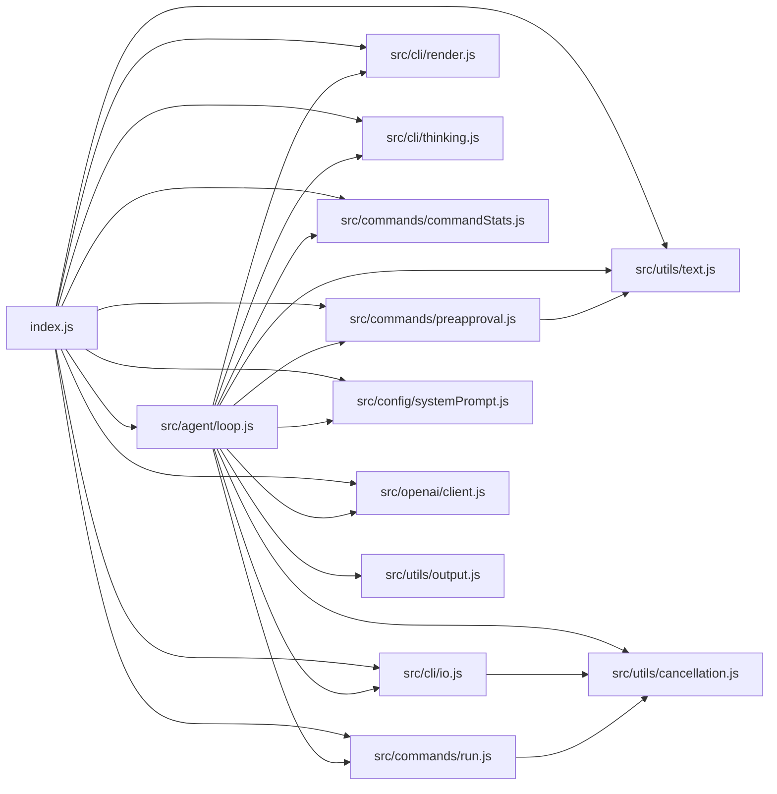

# JavaScript Dependency Graph

This diagram shows which JavaScript files within the OpenAgent ESM implementation import other files (relative import paths only).

_Generated via automated AST analysis using Acorn on the current workspace state._
