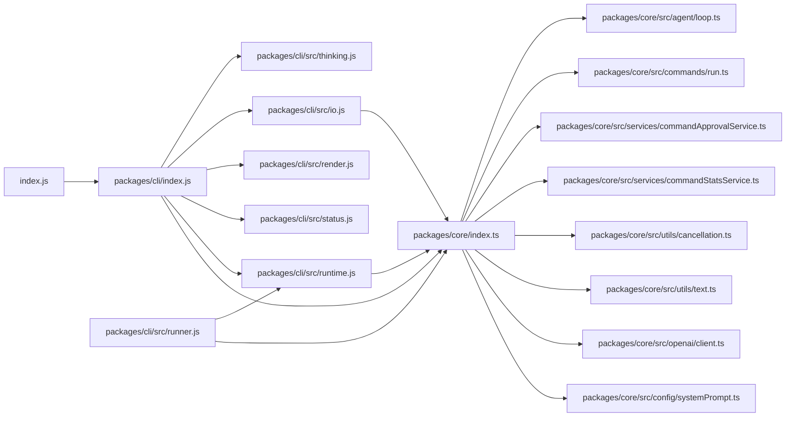

# JavaScript Dependency Graph

This diagram shows how the top-level CLI entry composes the core runtime after the workspace split (relative import paths).

_Updated after migrating to the `packages/core` + `packages/cli` workspace layout._
